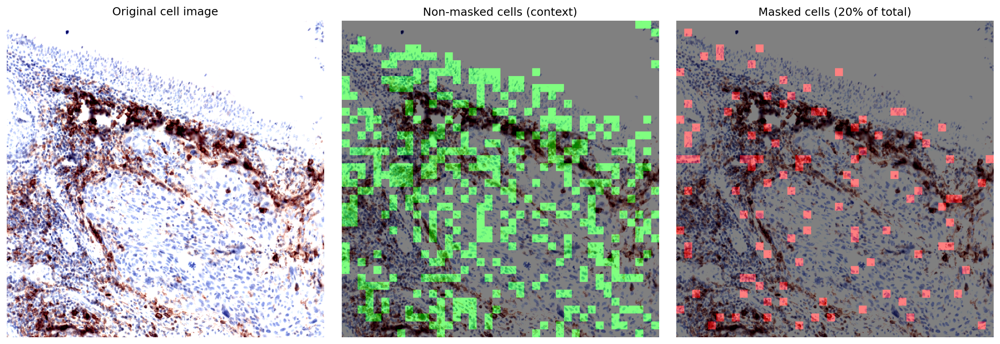

# medical-ijepa

The project researches a potential multimodal extension of the Image Based Join Embedding Predictive Architecture model, for medical image processing and classification.

Current focus of the project is: Cell classification based on microenvironmental context using I-JEPA and Multimodal (image-text) JEPA.

In previous experiments, the multimodal JEPA model outperformed the standard LeNet CNN on a image classification task on the CIFAR-10 dataset (see `/results/jepa_vs_lenet`) using a CLS token for global representation. 

Based on these results, the current research direction is to investigate the local representation learning capabilities of the JEPA architecture.
