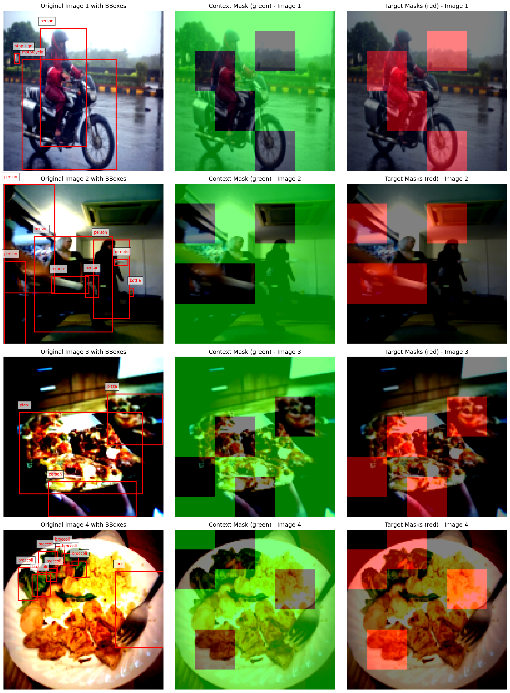

# jepa-lightweight

The project contains several implementations for JEPA models (I-JEPA, LLM-JEPA, Multimodal-JEPA).

Current aim of the project: Classify cell by its microenvironment using I-JEPA and Multimodal (image-text) JEPA.

