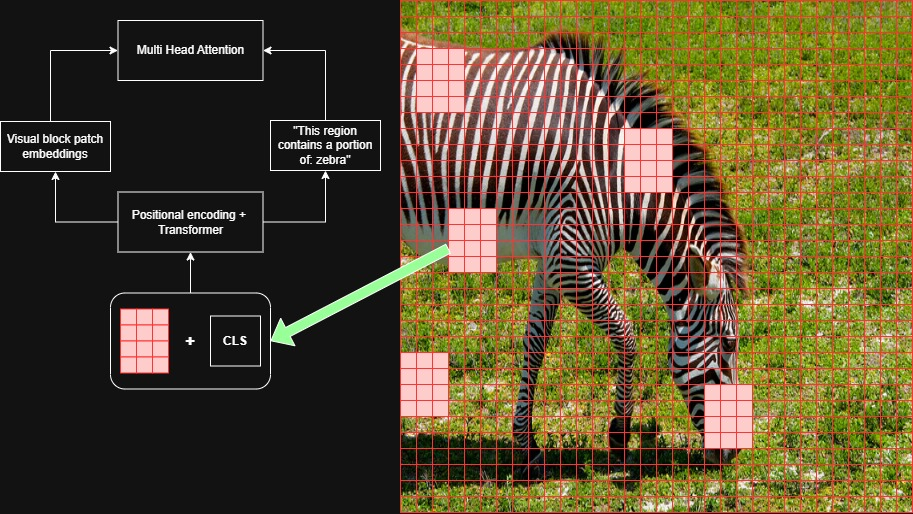
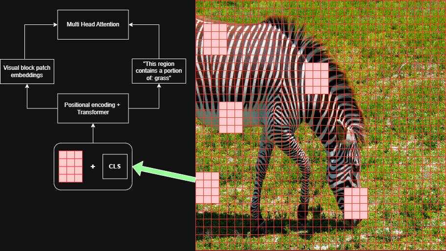

# I-JEPA for multi-class image classification

## Overview

This repository explores a potential extension of the image-based Joint-Embedding Predictive Architecture (I-JEPA) from global image classification to local, instance-level classification.

Instead of predicting a single global label for the full image, this project focuses on building localized representations for image patches or objects and classifying them in their local context.

An optional multimodal layer can be added to the architecture, enabling joint image-text modeling for richer context-aware predictions.

## Architecture

The project implements a local JEPA variant where the model learns to predict region-level targets inside a shared embedding space.

## Repository Structure

- `local_jepa.py` — main script for running local I-JEPA training, fine-tuning and evaluation
- `train/train_local_jepa.py` — local JEPA training algorithm
- `train/train_ijepa.py` — global JEPA training algorithm
- `src/models/` — model definitions including `vit.py`, `lenet_cnn.py`, `predictor.py`, and `unet.py`
- `src/utils/` — utility modules for masking, positional encoding, EMA, logging, and config
- `src/data_preprocess/` — dataset loaders and preprocessors for CIFAR-10, COCO and other domains
- `results/` — experiment logs, evaluation files, and comparison notebooks
- `data/` — dataset storage and preprocessing files

## Datasets

- CIFAR-10 is used for earlier JEPA vs. CNN comparisons. (global level)
- The current research focus is region level block classification on the COCO dataset.

## Experiments and Results

- Prior experiments demonstrated that a multimodal JEPA setup outperformed a standard LeNet CNN on CIFAR-10 global classification.
- The current direction investigates local representation learning technique using a determinisctic masking strategy and region-level processor modules.
- Results are available under `results/jepa_vs_lenet` and `results/local_jepa`.

## Notes

- The repository is an experimental research codebase. (Hyperparameter optimalization is still in progress)
- The multimodal option is optional and can be enabled when joint image-text data is available.
